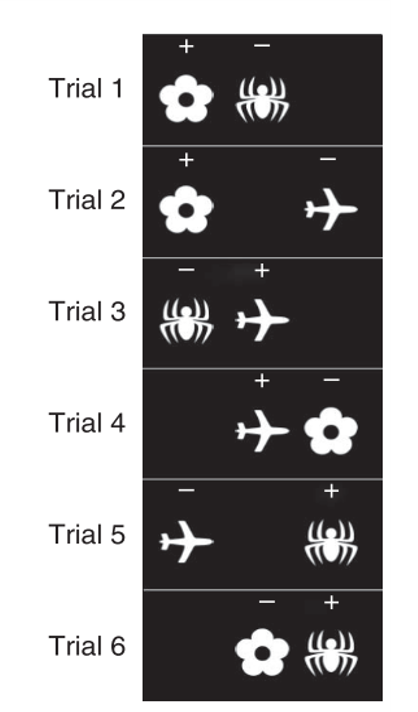
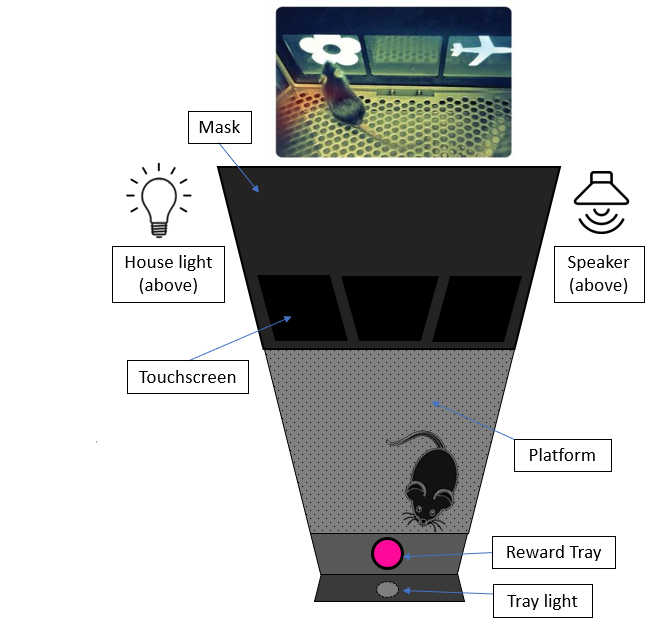
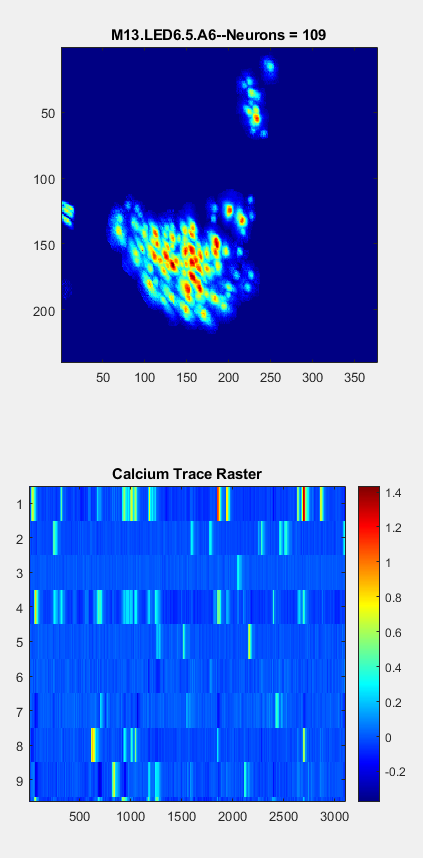
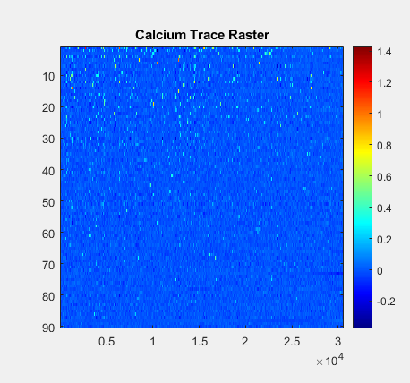

# haqqeez_bhs2020_project

Team contributors: Zeeshan Haqqee

## Summary 

I have in-vivo calcium imaging data in mice while they performed behavioural learning tasks in a touchscreen chamber. I want to figure a way to consolidate the neural data (activity of hundreds of individual cells over time (~3000 30ms time bins)) with behavioural data (actions and decisions made by the animal during their behavioural task).

## Project definition 

### Background

For BHS, project details TBD. Currently trying to figure out what would be interesting to analyze/decode from my data.

For each animal, in a single session of recording, I have have time series data (in the form of calcium activity) of 100-300 individual neurons, recorded over roughly 3000 time bins (frames). Separately, I have behavioural data in the form of scores (% correct performance on individual trials of the memory task the animal does), reaction times, latency, error rate, etc. 

The goal of the task is for the mouse to learn the specific objects give reward only if they are in specific locations. Otherwise, they are a distractor. 6 Different trial type combinations exist from 3 object-location associations that they need to learn. These 6 trial types are presented randomly. 36 total trials (6 x 6) per session:

  

Meanwhile, Calcium imaging data looks similar to what you would see in 'spiking' data for single-unit electrophysiology. Plus a spatial 'footprint' of what the miniscope camera sees as individual cells (circles) when recording activity in the brain (top plot).

      (sorry for using jet colormap! ^^' )

For the bottom plot (left; zoomed in, right; same but zoomed out) The y axis is each one individual cell. The x-axis is time (in frames). A more yellow colour = stronger fluoresence measured = higher calcium = inferred neuronal activity (action potentials, graded potentials, synaptic potentials etc.)

Big overarching question: How does neural activity change over time as the animal gets better at the memory task? Are there clusters of cells that activate during certain events? (Incorrect vs. correct choices, left vs. right vs middle response, etc.).

### Tools 

For a detailed review of methodology, see: https://www.biorxiv.org/content/10.1101/2020.02.06.937573v1.full

### Data 

### Deliverables

At the end of this project, we will have:
 
## Results 

### Progress overview

### Tools I learned during this project

 

#### Deliverable 1: report template

#### Deliverable 2: project gallery

## Conclusion and acknowledgement

