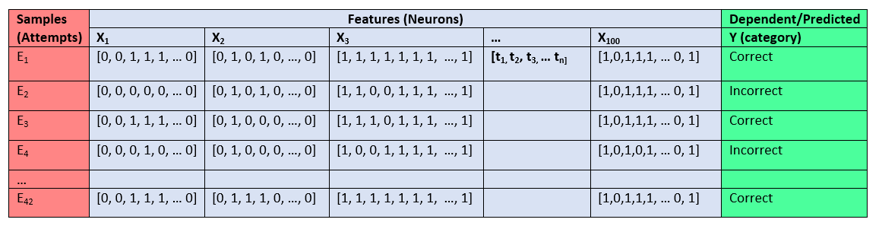

# haqqeez_bhs2020_project

## Summary 

I have calcium imaging data in mice while they performed behavioural learning tasks in a touchscreen chamber. I want to figure a way to consolidate the neural data (activity of ~100 individual cells over time (~30,000 x ~30ms time bins)) with behavioural data (time-stamped actions and decisions made by the animal during their behavioural task).

## Project definition 

### Background: Behavioural task

The goal of the task is for the mouse to learn that specific objects on the screen will give a reward only if they are touched when in specific locations. Otherwise, they are a distractor. For example, for Trial type 1, the flower will give a reward because it is displayed on the left, but the spider will not. For Trial type 6, the flower will not give a reward because it is in the middle, but the spider will, because it is on the right.

6 Different trial type combinations exist from 3 object-location associations (flower-left, airplane-middle, spider-right) that the mice need to learn. These 6 trial types are presented randomly. 36 total trials (6 x 6) per session:

        

### Background: Calcium imaging

The mouse completes the task with a miniatrue microscope (miniscope) implanted on its head, which shines an LED light onto an implanted lens to illuminate genetically modified neurons that fluoresce (i.e., light-up) whenever calcium is being used by the cell. In the same way that fMRI infers brain activity from blood-oxygen levels, calcium imaging infers neuronal activity from calcium concentration in the cell (indicating action potentials, graded potentials, synaptic potentials etc.)

This is what the camera sees. A MATLAB script takes each frame and determines which groups of pixels are neurons and which are not and tags and counts them.

Once tagged, each neurons's brightness level is measured to infer calcium activity. The raster plots generated here looks similar to what you would see in 'spiking' data for single-unit electrophysiology.

     

(left; zoomed in, right; same but zoomed out) The y axis is each one individual neuron. The x-axis is time (in frames; ~30ms). A more yellow colour = stronger fluoresence measured = higher likelihood of neuronal activity.

Big overarching question: How does neural activity change over time as the animal gets better at the memory task? Are there clusters of cells that activate during certain events? (Incorrect vs. correct choices, left vs. right vs middle response, etc.).

For a detailed review of general tools and methodology, see: https://www.biorxiv.org/content/10.1101/2020.02.06.937573v1.full

### Data 

Behavioural data is time-stamped for every action done by the animal (touching the screen, drinking reward, incorrect choice, correct choice, etc.)

Calcium data is a matrix representing NumberofCells x TotalFrames (e.g., 100 cells and 30,000 frames is a 100 x 30000 matrix). Where each value in the matrix represents fluoresence level (inferred spiking probability) for a particular cell at a particular frame in time.

Hence, the design of my data uses the activity of individual neurons as its features (x-values), the behavioural events as its dependent or predictor variables (y-values). A 'sample' here is defined as each individual attempt made by animal on the task.

Note: Ones and zeros here denote the cell being 'on' or 'off' for sake of simplicity. In reality, the activity is defined as a transient of activity based on the change in fluoresence measured by the image analysis software.

### Learning Goals

The primary issue with my analysis design is that each cell's activity is its own time-series, which makes it difficult or impossible to use with traditional machine learning tools (at least, in its current format). Thus, my first goal is to pre-process my time series data into a meaningful format for cell-by-cell and population level analyses. 

1. For single-cell analysis, I have the option of using the time series data of a single cell. However, treating each frame in the time series as its own indepedent variable is not realible; any slight jitter in the cell activity from trial to trial will make it impossible to find recurring patterns. To fix this, I will use a sliding window that takes the average of a few frames, effectively smoothing out the time series for each trial to allow a more liberal overlap of activity between trials.

2. From the single-cell analysis, I have the option of taking the cell-by-cell predicted categories and inputting them into a random forest analysis to test whether neurons show any kind of 'democratic' coding for correct vs. incorrect attempts.

3. For the population level analysis, I have the option of condensing my time series data into mean firing or total firing across the time series per cell, then using this overall activity score to predict behavioural events.

4. Finally, I can also apply nilearn tools to compute a correlation matrix between cells, and using those correlation values as my features to predict behaioural events.

### Tools

* Python
* Jupyter notebooks
* nilearn
* scikitlearn
* MATLAB
 
## Results 

### Progress overview

### Tools I learned during this project

 

#### Deliverable 1: report template

#### Deliverable 2: project gallery

## Conclusion and acknowledgement

## Future directions

I will try to adapt what I learned from the fMRI machine learning tutorial to accomplish two goals:

* Define correlation matrices between neurons and compare strengths over time; does it change with learning?
* Use machine learning to predict and decode correct vs incorrect events in the population activity of the cells.

Recall from the machine learning tutorial, we looked at activity of different subjects. For each subject, activity for each brain region was averaged across time and then correlated with brain regions in a correlation matrix. We then took each correlation matrix and created a new feature matrix across all subjects, then looked for a target variable, age, across subjects.

For my data I only have one animal and a few different days. So will have to adapt:

Subjects = Trials (42 attempts/decisions made in a session)
time_series array = (120 frames, 100 neurons)
Correlation matrix for ONE subject (trial) = 100 x 100 neurons array
Feature matrix = 42 subjects (trials) x 10,000 features (neurons)

Target variable will be CATEGORICAL (Correct vs Incorrect vs. Neither). Predict which subject (Trial) belongs to which category (correct/incorrect decision) from the neuronal data.

At the end of this project, I aim to have:

* Pairwise correlation data for neurons for each trial event in a session, possibly across different sessions (days)
* A rough machine learning pipeline to decode different types of events in the behaviour

